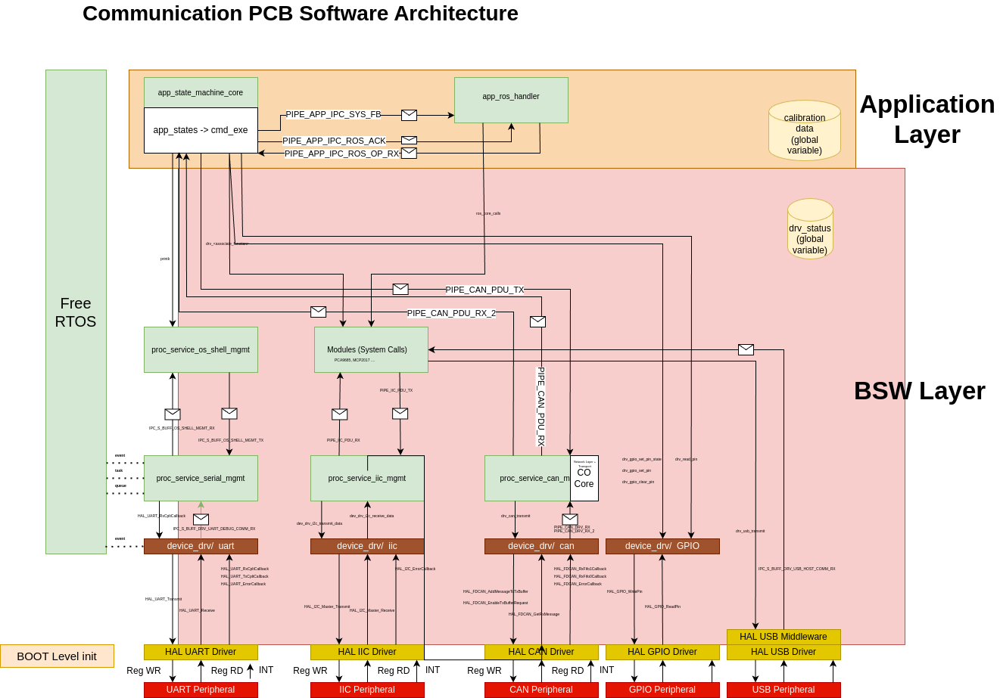

# RTOS_Basic_Software
Basic software: A lightweight kernel can be deployed to any processor.
This can be included as a submodule to any project like the STM32 or Microchip SAM projects.

Currently supported cores
Cortex M4
Cortex M7

## Architecture

